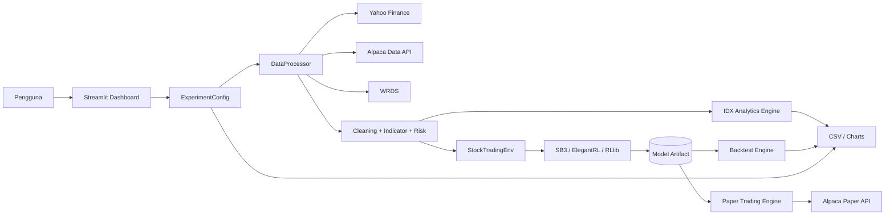
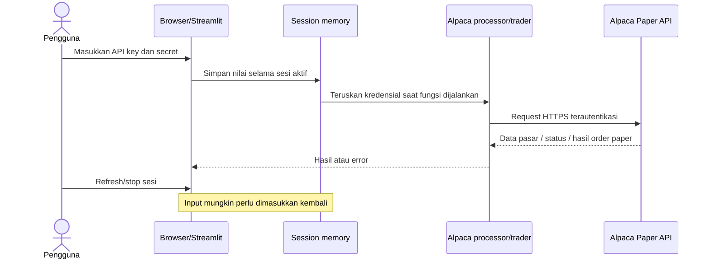
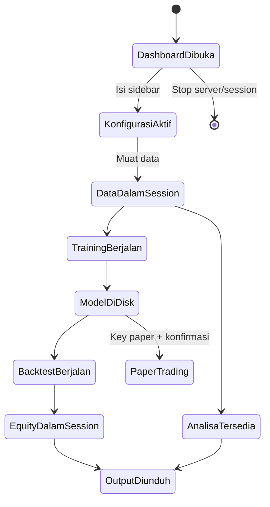
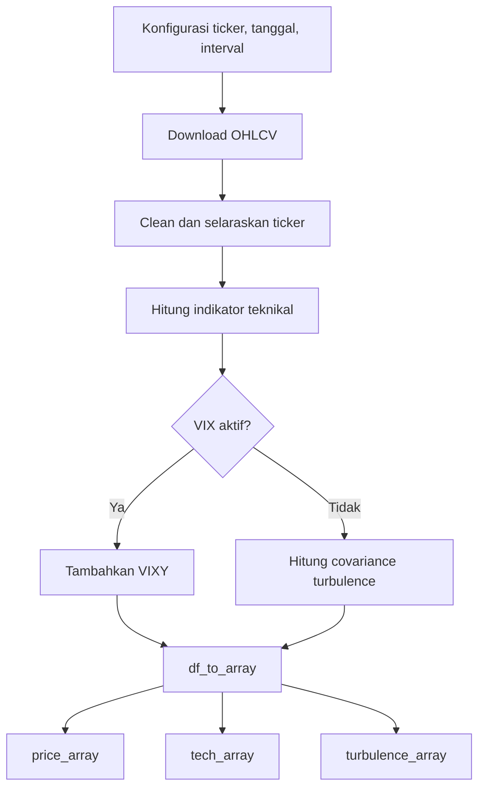
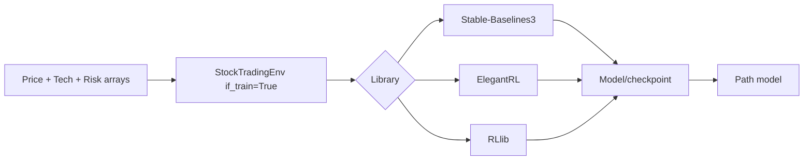
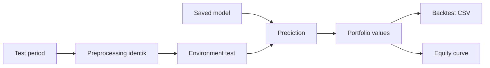
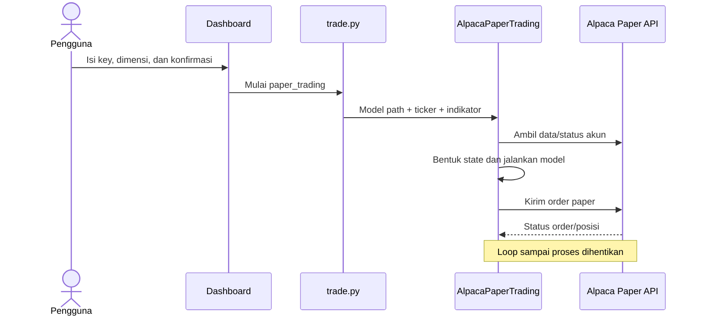

# Panduan FinRL Workbench

Panduan ini menjelaskan fungsi dan pengoperasian dashboard, analisis saham
Indonesia, training, backtest, dan paper trading.

> Hasil analisis dan model adalah alat riset, bukan rekomendasi investasi.
> Paper trading tetap membuat order pada akun simulasi Alpaca.

## 1. Gambaran sistem

Alur aplikasi: pilih universe dan sumber data → muat data → analisis IDX → train
model → backtest out-of-sample → opsional paper trading.

| Komponen | Fungsi |
|---|---|
| `finrl/dashboard.py` | UI Streamlit dan orkestrasi E2E |
| `finrl/analytics/indonesia.py` | Screening dan analisis saham Indonesia |
| `finrl/meta/data_processor.py` | Unduh, bersihkan, dan transformasi data |
| `finrl/train.py` | Training model DRL |
| `finrl/test.py` | Memuat model dan menjalankan backtest |
| `finrl/trade.py` | Backtest atau paper trading Alpaca |
| `scripts/setup_env.sh` | Membuat environment dan memasang dependensi |
| `scripts/check_setup.py` | Memeriksa kesiapan instalasi |

## 2. Instalasi dan pemeriksaan

Jalankan dari root repository:

```bash
cd /Users/user/Projects/FinRL
sh scripts/setup_env.sh
```

Skrip membuat `.venv311`, memasang dependensi, dan memeriksa setup. Default-nya
menggunakan `/Users/user/.local/bin/python3.11`; lokasi Python dapat diganti:

```bash
PYTHON_BIN=/path/ke/python3.11 sh scripts/setup_env.sh
```

Pemeriksaan dapat diulang tanpa instalasi:

```bash
.venv311/bin/python scripts/check_setup.py
```

Pemeriksaan mencakup NumPy, pandas, Streamlit, PyTorch, Gym, library DRL, Yahoo
Finance, Alpaca, TA-Lib, folder output, dan import dashboard. Pesan `Setup siap`
menandakan seluruh pemeriksaan berhasil.

| Folder | Isi |
|---|---|
| `datasets/` | Data yang disimpan workflow lain dalam repository |
| `trained_models/` | Model hasil training |
| `results/` | Hasil eksperimen |
| `tensorboard_log/` | Log TensorBoard |

## 3. Menjalankan dashboard

```bash
cd /Users/user/Projects/FinRL
.venv311/bin/streamlit run finrl/dashboard.py
```

Buka alamat yang diberikan Streamlit, biasanya `http://localhost:8501`. Gunakan
executable dari `.venv311` agar versi dependensinya konsisten.

### Navigasi aplikasi

| Menu | Fungsi |
|---|---|
| Beranda | Status kesiapan data, model, dan evaluasi |
| Data Market | Download, quality check, coverage, dan histori per ticker |
| Analisa IDX | Screener, performa, risk, korelasi, dan breadth |
| Training | Melatih model dan menyimpan manifest |
| Model & Evaluasi | Load model, validasi konfigurasi, backtest, dan benchmark |
| AI Research Copilot | Analisis tambahan melalui 9Router/OpenRouter/gateway kompatibel |
| Monitoring & Notifikasi | Monitoring periodik dan pengiriman laporan Telegram |
| Paper Trading | Pengujian order simulasi Alpaca untuk instrumen yang didukung |
| Dokumentasi & Output | Panduan, diagram engine, dan unduhan artefak |

Panel konfigurasi tetap tersedia di bawah menu navigasi sehingga konfigurasi
yang sama dipakai saat berpindah halaman.

## 4. Panel konfigurasi

Semua tab memakai konfigurasi aktif pada sidebar.

### Load konfigurasi atau manifest

Gunakan uploader **Load konfigurasi / manifest** untuk memuat
`finrl_experiment_config.json` atau `<path-model>.config.json`. Setelah memilih
file, tekan **Terapkan konfigurasi**. Dashboard mengisi kembali universe, ticker
beserta urutannya, sumber, interval, tanggal, indikator, fitur risiko, library,
model, path, timesteps, dan parameter agent.

Kredensial Alpaca tidak disimpan di manifest dan harus dimasukkan manual. Load
manifest adalah cara utama memastikan bentuk input model sama seperti saat
training.

### Universe saham

| Pilihan | Fungsi |
|---|---|
| LQ45 Indonesia | Preset 45 ticker dengan suffix Yahoo Finance `.JK` |
| SRI-KEHATI Indonesia | Preset 25 ticker indeks berorientasi keberlanjutan |
| Custom Indonesia | Contoh saham Indonesia yang bebas diedit |
| Custom global | Contoh lima saham Dow 30 yang bebas diedit |

Kolom ticker menerima daftar dipisahkan koma, misalnya:

```text
BBCA.JK, BBRI.JK, BMRI.JK, TLKM.JK
```

Gunakan suffix `.JK` untuk ticker IDX melalui Yahoo Finance.

### Sumber data

- **yahoofinance**: pilihan praktis untuk eksperimen saham Indonesia.
- **alpaca**: memerlukan API key, secret, dan base URL. Kredensial dashboard
  hanya disimpan dalam memori sesi.
- **wrds**: memerlukan akun dan konfigurasi WRDS pada mesin pengguna.

Alpaca terutama melayani pasar AS. Gunakan Yahoo Finance untuk ticker IDX kecuali
sumber Alpaca yang digunakan memang mendukung instrumennya.

### Interval dan rentang waktu

Pilihan interval: `1D`, `1Min`, `5Min`, `15Min`, dan `1H`. Dukungan aktual
bergantung pada sumber data. Rentang **Train** dipakai untuk training dan rentang
**Test** untuk evaluasi. Sebaiknya keduanya tidak tumpang tindih.

### Indikator teknikal

| Indikator | Fungsi |
|---|---|
| `macd` | Momentum dan arah tren dari exponential moving average |
| `boll_ub`, `boll_lb` | Batas atas dan bawah Bollinger Bands |
| `rsi_14` | Relative Strength Index periode 14 untuk momentum jangka pendek |
| `rsi_30` | Relative Strength Index periode 30 |
| `cci_30` | Commodity Channel Index periode 30 |
| `dx_30` | Directional Movement Index periode 30 |
| `close_30_sma` | SMA harga penutupan 30 periode |
| `close_60_sma` | SMA harga penutupan 60 periode |

Jumlah indikator memengaruhi dimensi state. Konfigurasi model saat backtest harus
konsisten dengan saat training.

RSI memiliki rentang 0–100. Secara umum nilai di atas 70 sering dibaca sebagai
overbought dan di bawah 30 sebagai oversold, tetapi RSI bukan sinyal transaksi
mandiri. Model lama yang dilatih sebelum `rsi_14` ditambahkan harus tetap diuji
dengan `rsi_14` tidak dipilih agar dimensi inputnya tidak berubah.

### VIX dan risk-free rate

**Gunakan VIX** menambahkan sinyal risiko pasar AS. Default-nya mati untuk
universe Indonesia karena VIX bukan ukuran langsung volatilitas IDX. Saat VIX
dimatikan, sistem otomatis memakai indeks turbulence berbasis kovarians return
sebagai fitur risiko untuk environment trading.

**Risk-free tahunan** dipakai menghitung Sharpe dan Sortino pada Analisa IDX.
Angka UI berupa persen; `6` berarti `0,06` per tahun.

### Library dan model

| Library | Model tersedia |
|---|---|
| Stable-Baselines3 | A2C, DDPG, PPO, SAC, TD3 |
| ElegantRL | DDPG, PPO, SAC, TD3 |
| RLlib | A2C, DDPG, PPO, TD3 |

**Path model** adalah lokasi simpan dan lokasi baca saat backtest. **Training
timesteps** mengatur panjang training. Pada RLlib, dashboard mengubahnya menjadi
minimal satu episode per 1.000 timestep.

**Parameter agent** wajib berupa JSON object valid. Contoh:

```json
{
  "learning_rate": 0.0003,
  "batch_size": 64
}
```

Nama parameter harus didukung library/model. Expander **Konfigurasi aktif**
menampilkan konfigurasi final yang akan dijalankan.

### Cara merancang konfigurasi eksperimen

Satu eksperimen adalah kombinasi tetap dari universe, urutan ticker, sumber data,
rentang waktu, interval, indikator, fitur risiko, algoritma, hyperparameter, dan
path model. Ubah satu kelompok parameter pada satu waktu agar penyebab perubahan
hasil lebih mudah ditelusuri.

#### 1. Tentukan pertanyaan eksperimen

Mulai dari pertanyaan yang spesifik, misalnya:

- apakah PPO dengan RSI 14 dan indikator tren mengungguli konfigurasi tanpa RSI;
- apakah model tetap stabil pada periode pasar turun;
- apakah universe likuid memberikan drawdown lebih rendah; atau
- apakah penambahan turbulence memperbaiki pengendalian risiko.

Jangan memilih parameter hanya karena menghasilkan backtest tertinggi. Tetapkan
hipotesis sebelum melihat hasil untuk mengurangi risiko memilih konfigurasi yang
kebetulan cocok dengan data historis.

#### 2. Pilih universe dan ticker

- Gunakan **LQ45** untuk cakupan saham likuid yang lebih luas.
- Gunakan **SRI-KEHATI** untuk eksperimen pada preset saham berorientasi
  keberlanjutan.
- Gunakan **Custom Indonesia** untuk watchlist pribadi atau eksperimen kecil.
- Pertahankan urutan ticker antara training, backtest, dan inferensi karena setiap
  posisi aksi model terkait dengan posisi ticker pada array input.
- Simpan daftar ticker dalam konfigurasi JSON. Preset indeks bersifat statis dan
  tidak otomatis merekonstruksi konstituen historis pada setiap tanggal.

Menggunakan anggota indeks hari ini pada periode historis dapat menimbulkan
survivorship bias. Untuk riset yang lebih ketat, gunakan daftar konstituen yang
benar-benar berlaku pada setiap periode penelitian.

#### 3. Pilih sumber dan kualitas data

Untuk IDX, mulai dengan **Yahoo Finance** dan interval harian. Sebelum training:

- periksa tanggal pertama dan terakhir setiap ticker;
- periksa jumlah observasi setiap ticker;
- cari harga/volume kosong atau nol yang tidak wajar;
- periksa aksi korporasi dan perubahan ticker;
- pastikan mata uang serta satuan volume konsisten; dan
- ekspor CSV data pasar sebagai bukti dataset yang digunakan.

Data yang lebih panjang tidak selalu lebih baik bila rezim pasar terlalu berbeda
dengan kondisi yang ingin diprediksi. Sebaliknya, periode terlalu pendek membuat
estimasi risiko dan pembelajaran model tidak stabil.

#### 4. Pisahkan train, validation, dan test

UI menyediakan rentang train dan test. Gunakan sebagian akhir periode train
sebagai validation saat melakukan tuning manual, lalu pertahankan test sebagai
periode yang belum pernah dipakai memilih model.

Contoh pembagian berbasis waktu:

| Bagian | Contoh | Fungsi |
|---|---|---|
| Train | 2014–2019 | Model mempelajari pola |
| Validation | 2020 | Memilih indikator dan hyperparameter |
| Test | 2021–2023 | Evaluasi final out-of-sample |
| Forward/paper | Setelah test | Observasi perilaku pada data berikutnya |

Tanggal hanyalah contoh; sesuaikan dengan ketersediaan data. Jangan mengacak data
time series dan jangan membiarkan data masa depan masuk ke fitur masa lalu.

#### 5. Pilih interval

| Interval | Cocok untuk | Konsekuensi |
|---|---|---|
| `1D` | Analisis posisi harian dan eksperimen awal | Lebih ringan dan lebih stabil |
| `1H`/`15Min` | Eksperimen intraday | Data lebih besar; spread dan slippage makin penting |
| `5Min`/`1Min` | Riset frekuensi lebih tinggi | Sangat sensitif pada biaya, latency, dan kualitas data |

Model dari satu interval tidak boleh langsung dipakai pada interval lain karena
arti satu langkah, indikator, frekuensi aksi, dan distribusi return berubah.

#### 6. Pilih indikator

Mulai dari set kecil yang mewakili fungsi berbeda:

- momentum: `rsi_14`, `rsi_30`, `macd`;
- volatilitas/range: `boll_ub`, `boll_lb`;
- arah/kekuatan tren: `dx_30`, `close_30_sma`, `close_60_sma`; dan
- risiko pasar: VIX atau turbulence.

Lebih banyak indikator menambah dimensi state tetapi tidak otomatis memperbaiki
hasil. Indikator yang sangat mirip dapat membawa informasi redundan. Bandingkan
eksperimen baseline, baseline + RSI 14, dan baseline + fitur tren secara terpisah.

#### 7. Pilih sinyal risiko

- Untuk IDX, matikan VIX agar sistem menggunakan turbulence berbasis kovarians.
- Untuk universe AS, VIX dapat dipakai sebagai proxy sentimen/risiko pasar.
- Gunakan pilihan yang sama saat training dan backtest.
- Risk-free rate hanya memengaruhi metrik Sharpe/Sortino pada analisis IDX, bukan
  reward atau aksi model trading saat ini.

#### 8. Pilih library dan algoritma

- **PPO** adalah baseline praktis untuk memulai dan membandingkan eksperimen.
- **A2C** tersedia pada Stable-Baselines3 dan RLlib.
- **DDPG, TD3, dan SAC** menangani action space kontinu, tetapi sensitivitasnya
  terhadap hyperparameter dan random seed perlu diuji.
- Hasil antar-library tidak langsung sebanding jika jumlah langkah, episode,
  implementasi model, atau default hyperparameter berbeda.

Jalankan beberapa seed bila ingin menilai kestabilan. Satu training run dapat
memberikan hasil yang berbeda karena inisialisasi dan eksplorasi acak.

#### 9. Atur timesteps dan hyperparameter

Gunakan tahapan berikut:

| Tahap | Timesteps | Tujuan |
|---|---:|---|
| Smoke test | 1.000–5.000 | Memastikan pipeline dan penyimpanan model bekerja |
| Eksperimen awal | 25.000–100.000 | Membandingkan beberapa konfigurasi |
| Kandidat final | Ditentukan dari kurva belajar | Melatih ulang konfigurasi terpilih |

Angka tersebut adalah titik awal operasional, bukan jaminan konvergensi. Pantau
reward dan evaluasi out-of-sample. Contoh parameter yang sering diubah:

| Parameter | Pengaruh umum |
|---|---|
| `learning_rate`/`lr` | Besar pembaruan bobot model |
| `batch_size` | Jumlah sampel setiap pembaruan |
| `gamma` | Bobot reward masa depan |
| `train_batch_size` | Ukuran batch training RLlib |
| `eval_times` | Jumlah evaluasi pada ElegantRL |

Ubah secara bertahap dan simpan JSON setiap eksperimen. Parameter yang tidak
didukung library akan menyebabkan error saat model dibuat.

#### 10. Gunakan path model yang unik

Gunakan pola nama yang menjelaskan eksperimen, misalnya:

```text
trained_models/idx_lq45_ppo_rsi14_daily_v1
```

Jangan memakai path yang sama untuk konfigurasi berbeda karena artefak lama dapat
tertimpa atau salah dimuat. Simpan bersama:

- `finrl_experiment_config.json`;
- CSV data pasar;
- CSV screener;
- CSV hasil backtest; dan
- catatan versi kode serta tanggal eksperimen.

### Contoh konfigurasi eksperimen

#### Baseline cepat

| Parameter | Nilai |
|---|---|
| Universe | Custom Indonesia, 3–5 ticker likuid |
| Sumber/interval | Yahoo Finance / `1D` |
| Indikator | MACD, RSI 14, SMA30, SMA60 |
| VIX | Nonaktif; turbulence otomatis |
| Library/model | Stable-Baselines3 / PPO |
| Timesteps | 5.000 untuk smoke test |
| Tujuan | Memvalidasi seluruh alur E2E |

#### Perbandingan indikator

Buat minimal dua eksperimen dengan train/test dan hyperparameter identik:

| Eksperimen | Indikator pembeda |
|---|---|
| A | Baseline tanpa RSI 14 |
| B | Baseline + RSI 14 |

Bandingkan return, drawdown, bentuk equity curve, konsistensi lintas periode, dan
bukan hanya nilai akhir. Jangan mengganti universe dan indikator sekaligus karena
hasilnya sulit diatribusikan.

#### Uji ketahanan lintas rezim

Uji kandidat model pada beberapa rentang test terpisah yang mewakili pasar naik,
turun, volatil, dan sideways. Model lebih layak dipertimbangkan sebagai informasi
tambahan bila perilakunya tidak hanya baik pada satu periode pilihan.

### Pemeriksaan sebelum menekan Train

- Ticker valid dan urutannya sudah final.
- Data train berakhir sebelum data test dimulai.
- Dataset telah dimuat dan riwayat tiap ticker diperiksa.
- Indikator yang dipilih sesuai tujuan eksperimen.
- VIX/turbulence sesuai universe.
- JSON parameter valid.
- Path model unik.
- Konfigurasi aktif sudah diunduh.

## 5. Tab Data

Tekan **Muat & validasi data**. Sistem akan:

1. mengunduh OHLCV;
2. membersihkan dan menyelaraskan data antar-ticker;
3. menghitung indikator teknikal;
4. menambahkan VIX bila aktif; dan
5. menyimpan hasil pada cache dan session dashboard.

Setelah berhasil, aplikasi menampilkan 100 baris terakhir dan grafik harga
penutupan. Data dimuat dari awal train sampai akhir test agar dapat langsung
dipakai Analisa IDX. Jika konfigurasi berubah, tekan tombol muat kembali.

CSV data pasar adalah sumber histori utama per ticker. Filter kolom `tic` untuk
melihat satu saham dan gunakan `timestamp`, OHLCV, serta indikator untuk audit
lengkap. Grafik dashboard memberi inspeksi cepat, sedangkan CSV dapat dipakai
untuk analisis lebih rinci di spreadsheet atau Python.

Halaman Data Market juga menyediakan **Data quality & coverage** berisi tanggal
awal/akhir, jumlah observasi, dan missing close per ticker. Bagian **Histori per
ticker** menampilkan harga, RSI 14/30, MACD, dan 250 baris terakhir bila tersedia.

## 6. Tab Analisa IDX

Tab aktif setelah data dimuat dan memerlukan kolom waktu, ticker, close, dan
volume.

### Filter dan ringkasan

- **Jumlah saham ditampilkan** membatasi ranking teratas.
- **Minimum rata-rata nilai transaksi 20 hari** menyaring estimasi likuiditas
  `harga × volume`.
- **Unduh screener CSV** mengekspor seluruh ranking.
- **Saham dianalisis** menunjukkan jumlah ticker valid.
- **Advancers** adalah persentase return positif pada hari terakhir.
- **Di atas SMA20/SMA50** adalah persentase saham di atas moving average terkait.

### Ranking dan composite score

Saham diranking dengan skor relatif 0–100. Bobotnya:

| Komponen | Bobot |
|---|---:|
| Momentum return 6 bulan | 30% |
| Sharpe ratio | 25% |
| Tren SMA20/50/200 | 20% |
| Volatilitas rendah | 15% |
| Likuiditas | 10% |

Skor bersifat cross-sectional: perubahan universe dapat mengubah ranking.

| Kolom screener | Arti |
|---|---|
| `price` | Harga penutupan terakhir |
| `return_1m/3m/6m/12m` | Return 21/63/126/252 hari bursa |
| `annual_return` | Rata-rata return harian × 252 |
| `annual_volatility` | Deviasi standar harian × √252 |
| `sharpe` | Excess annual return / volatilitas tahunan |
| `sortino` | Excess annual return / downside volatility |
| `max_drawdown` | Penurunan terburuk dari puncak sebelumnya |
| `daily_var_95` | Kuantil 5% return harian |
| `daily_cvar_95` | Rata-rata return pada ekor lebih buruk dari VaR |
| `avg_volume_20d` | Volume rata-rata 20 hari |
| `avg_value_idr_20d` | Harga × volume rata-rata 20 hari |
| `liquidity_change` | Volume 20 hari dibanding rata-rata 60 hari |
| `above_sma20/50/200` | Posisi harga terhadap SMA |
| `observations` | Jumlah observasi return |

### Performa

Membandingkan saham dengan harga awal dinormalisasi menjadi 100. Grafik
menunjukkan pertumbuhan relatif, bukan selisih nominal harga.

### Risk

Menampilkan volatilitas, max drawdown, VaR, CVaR, Sharpe, dan Sortino. Grafik
drawdown bernilai 0 pada puncak baru dan negatif saat berada di bawah puncak.

### Korelasi

Heatmap korelasi return harian untuk maksimal 20 saham hasil filter. Merah berarti
hubungan positif/searah, biru berarti hubungan negatif/berlawanan, dan putih
berarti hubungan linear lemah. Setiap sel menampilkan angka korelasi dan tooltip
ticker. Matriks angka asli tetap tersedia dalam expander. Perhitungan memerlukan
minimal 20 observasi berpasangan.

### Breadth

Riwayat persentase advancers serta saham di atas SMA20 dan SMA50. Breadth
menunjukkan apakah pergerakan pasar didukung banyak saham atau hanya sedikit.

## 7. Tab Train

Tekan **Mulai training**. Sistem mengunduh data train, menghitung fitur,
mengubahnya menjadi array `StockTradingEnv`, melatih model, lalu menyimpan model
ke **Path model**.

Praktik yang disarankan:

1. mulai dengan 3–5 ticker dan timesteps minimum untuk smoke test;
2. pastikan tab Data berhasil sebelum training besar;
3. gunakan path berbeda untuk setiap eksperimen;
4. simpan konfigurasi bersama artefak model; dan
5. naikkan timesteps setelah alur kecil berhasil.

Setelah training berhasil, dashboard menyimpan model pada **Path model** dan
membuat sidecar manifest `<path-model>.config.json`. Manifest tidak memuat API
key, tetapi menyimpan ticker beserta urutannya, sumber data, interval, tanggal,
indikator, VIX/turbulence, library, nama model, timesteps, dan parameter agent.

### Cara memakai model setelah training

#### Pilihan 1 — Load dan evaluasi dari dashboard

Ini adalah langkah pertama yang dianjurkan:

1. load file `<path-model>.config.json` dari sidebar;
2. pastikan **Path model** menunjuk artefak yang benar;
3. buka **Model & Evaluasi**;
4. pastikan status manifest kompatibel;
5. tekan **Load & validasi model**;
6. gunakan periode test out-of-sample;
7. tekan **Jalankan evaluasi**; dan
8. unduh CSV equity curve dan return.

Stable-Baselines3 umumnya menyimpan model sebagai `<path>.zip`, walaupun nilai
Path model pada UI tidak memakai ekstensi. ElegantRL dan RLlib dapat menyimpan
direktori/checkpoint. Loader dashboard menangani format sesuai library.

Jika Data Market sudah dimuat, evaluasi membandingkan strategi AI dengan
benchmark equal-weight buy-and-hold. Laporan memuat total return, annualized
volatility, max drawdown, Sharpe, grafik performa, grafik drawdown, dan checklist
bukti dasar.

Grafik tersebut adalah hasil inferensi kebijakan trading pada data test, bukan
prediksi harga masa depan. Model memilih action portofolio dan tidak menghasilkan
target harga atau confidence interval harga secara langsung.

#### Pilihan 2 — Memakai model melalui Python

Gunakan fungsi `test()` agar preprocessing, environment, dan loader model tetap
konsisten:

```python
from finrl.config import INDICATORS
from finrl.meta.env_stock_trading.env_stocktrading_np import StockTradingEnv
from finrl.test import test

portfolio_values = test(
    start_date="2024-01-01",
    end_date="2024-12-31",
    ticker_list=["BBCA.JK", "BBRI.JK", "BMRI.JK"],
    data_source="yahoofinance",
    time_interval="1D",
    technical_indicator_list=INDICATORS,
    drl_lib="stable_baselines3",
    env=StockTradingEnv,
    model_name="ppo",
    if_vix=False,
    cwd="trained_models/idx_ppo_rsi14",
)

print(portfolio_values[-1])
```

Ganti seluruh nilai dengan isi manifest model. Untuk model lama yang dilatih
sebelum RSI 14 ditambahkan, gunakan daftar indikator lama tanpa `rsi_14`.

#### Pilihan 3 — Paper trading

Setelah backtest dan review risiko:

1. buka tab **Paper Trade**;
2. pastikan Path model serta konfigurasi sama dengan manifest;
3. masukkan kredensial akun **Alpaca paper**;
4. verifikasi `state_dim` dan `action_dim`;
5. centang konfirmasi; dan
6. mulai paper trading serta monitor prosesnya.

Alpaca tidak mengeksekusi saham IDX. Model IDX tetap dapat dipakai untuk
backtest/sinyal, tetapi eksekusi IDX memerlukan integrasi broker Indonesia.

Kompatibilitas paper trading saat ini:

| Library | Model yang dapat dipakai |
|---|---|
| Stable-Baselines3 | A2C, DDPG, PPO, SAC, TD3 |
| ElegantRL | PPO |
| RLlib | PPO |

Dashboard menolak ticker `.JK` pada Paper Trade supaya order IDX tidak keliru
dikirim ke Alpaca. Gunakan Backtest untuk model Indonesia, atau gunakan universe
Alpaca yang didukung untuk menguji mekanisme order paper.

#### Konfigurasi yang wajib sama

| Parameter | Mengapa harus sama |
|---|---|
| Library dan model | Menentukan loader dan arsitektur model |
| Ticker dan urutannya | Posisi output action dipetakan ke ticker berdasarkan urutan |
| Daftar dan urutan indikator | Menentukan isi serta dimensi `tech_array` |
| Interval | Mengubah arti satu langkah dan distribusi fitur |
| VIX/turbulence | Menentukan fitur risiko dalam state |
| State/action dimension | Harus cocok dengan bobot jaringan yang disimpan |

Rentang tanggal test boleh dan memang sebaiknya berbeda, selama data tersedia
dan preprocessing-nya identik.

#### Checklist kelayakan sebelum dipakai

- Model dapat dimuat tanpa shape/dimension error.
- Backtest benar-benar memakai periode yang tidak terlihat saat training.
- Equity curve tidak hanya bergantung pada satu lonjakan atau satu ticker.
- Drawdown dan volatilitas masih sesuai batas risiko.
- Hasil diuji pada beberapa periode pasar dan, bila memungkinkan, beberapa seed.
- Biaya, slippage, likuiditas, lot size, dan batas transaksi dipertimbangkan.
- Paper trading berjalan stabil sebelum mempertimbangkan integrasi lebih lanjut.

## 8. Tab Backtest

Tekan **Jalankan backtest** untuk memuat model dari **Path model** dan mengujinya
pada periode test. Library, model, ticker, urutan ticker, indikator, dan VIX harus
sesuai dengan konfigurasi training.

Hasil berisi nilai awal, nilai akhir, return total, equity curve, dan tabel nilai
portofolio setiap langkah. Panel saat ini belum menampilkan benchmark IHSG atau
metrik lanjutan di luar mekanisme yang sudah dimodelkan environment.

## 9. Tab Paper Trade

Fitur ini menjalankan model pada **Alpaca Paper Trading**, bukan broker IDX.
Gunakan URL paper berikut:

```text
https://paper-api.alpaca.markets
```

Dimensi default:

```text
action_dim = jumlah ticker
state_dim  = 1 + 2 + (3 × jumlah ticker) + (indikator × jumlah ticker)
```

Masukkan key dan secret, centang konfirmasi, lalu tekan **Mulai paper trading**.
Proses berjalan terus; hentikan proses Streamlit untuk menghentikannya. Jangan
gunakan kredensial akun live. Pastikan model, universe, interval, dan dimensi
sama dengan training.

## 9A. AI Research Copilot

Menu ini mengirim ringkasan teknikal, konfigurasi eksperimen, dan hasil evaluasi
RL ke model AI eksternal melalui API yang kompatibel dengan format OpenAI.
Konektor dapat digunakan untuk:

- 9Router lokal, default `http://localhost:20128/v1`;
- OpenRouter, `https://openrouter.ai/api/v1`; atau
- gateway lain yang menyediakan `/models` dan `/chat/completions`.

### Cara menghubungkan router

1. Jalankan atau siapkan router.
2. Buka **AI Research Copilot**.
3. Isi Base URL dan API key bila router mensyaratkannya.
4. Tekan **Test koneksi & muat model**.
5. Pilih salah satu model yang dikembalikan endpoint `/models`.
6. Pilih satu atau beberapa fallback model dalam urutan prioritas.
7. Bila router tidak menyediakan daftar model, masukkan Model ID secara manual.

API key memakai input password dan hanya berada pada session Streamlit. Key tidak
masuk konfigurasi, manifest model, prompt preview, histori riset, atau hasil
unduhan.

### Bahan analisis yang dikirim

Copilot menyusun konteks dari:

- ticker fokus dan konfigurasi eksperimen;
- indikator terakhir dari Data Market;
- periode serta jenis risk feature;
- metrik out-of-sample model RL bila evaluasi sudah dijalankan; dan
- berita, laporan keuangan, sumber, atau catatan yang ditempel pengguna.

Tombol **Muat fundamental & berita Yahoo Finance** mengambil snapshot ringkas
berisi valuasi, pertumbuhan, profitabilitas, leverage, target harga yang tersedia,
dan maksimal sepuluh headline beserta penerbit, waktu, dan URL. Snapshot di-cache
15 menit, ditampilkan untuk diperiksa, lalu baru dimasukkan ke prompt setelah
pengguna memberikan persetujuan pengiriman.

Seluruh isi yang akan dikirim dapat diperiksa melalui **Preview data yang akan
dikirim**. Request baru aktif setelah pengguna mencentang persetujuan pengiriman
ke layanan eksternal.

### Mode riset

| Mode | Tujuan |
|---|---|
| Analisis lengkap | Menggabungkan teknikal, RL, konteks eksternal, dan risiko |
| Berita & katalis | Menilai implikasi berita yang diberikan pengguna |
| Fundamental | Membaca laporan/angka fundamental yang diberikan |
| Sentimen | Meringkas arah dan ketidakpastian sentimen |
| Jelaskan hasil model RL | Menjelaskan return, volatility, drawdown, dan Sharpe |
| Risk review | Mengutamakan skenario kerugian dan data yang belum tersedia |

### Temperature model AI

Temperature mengatur variasi pemilihan token model generatif. Parameter ini
tidak mengubah model reinforcement learning, data harga, composite score, atau
hasil backtest.

| Temperature | Karakter hasil | Penggunaan yang disarankan |
|---:|---|---|
| 0.0–0.15 | Paling konsisten dan konservatif | Ringkasan angka, risk review, laporan otomatis |
| 0.2–0.35 | Seimbang | Analisis rutin berita/fundamental dan penjelasan model |
| 0.4–0.65 | Lebih bervariasi | Eksplorasi skenario dan pertanyaan alternatif |
| 0.7–1.0 | Sangat variatif | Brainstorming; tidak disarankan untuk laporan finansial otomatis |

Default aplikasi adalah `0.2`. Temperature rendah tidak menjamin jawaban benar;
ia hanya mengurangi variasi. Hallucination tetap mungkin terjadi bila konteks
kurang, sumber tidak tersedia, atau model lemah. Untuk monitoring Telegram,
engine memakai `0.1` agar ringkasan lebih stabil.

Jika ingin membandingkan model secara adil, gunakan prompt, data, model,
temperature, dan waktu pengambilan sumber yang sama. Beberapa provider dapat
menerapkan parameter ini dengan perilaku yang sedikit berbeda.

Router tidak otomatis menjamin model memiliki akses internet atau informasi
terbaru. Karena itu, berita/fundamental aktual harus ditempel bersama tanggal dan
sumber, kecuali model/router yang dipilih memang menyediakan browsing yang sudah
dikonfigurasi dan hasilnya tetap diverifikasi.

System prompt mewajibkan model memisahkan fakta, inferensi, ketidakpastian,
skenario bullish, skenario bearish, risiko, dan langkah verifikasi. Hasil dapat
diunduh sebagai Markdown, tetapi tidak diperlakukan sebagai instruksi beli/jual.

Jika provider utama mengembalikan HTTP 403/429/5xx, Copilot mencoba fallback
yang dipilih secara berurutan. Untuk fallback yang dikelola langsung oleh
9Router, buat **Combo** pada dashboard 9Router dan gunakan nama combo sebagai
Model ID. HTTP 403 tetap perlu diperiksa pada menu Providers: koneksi akun,
izin model, kuota, atau cooldown/reset provider.

### Penyimpanan profil dan secret

Tombol **Simpan profil Copilot** menyimpan base URL, model utama, fallback,
temperature, dan mode riset ke `configs/ai_research.json`. API key tidak ditulis
ke file tersebut. Tombol **Simpan API key ke secure vault** menyimpannya melalui
credential vault OS dengan service name `finrl-workbench`.

Konfigurasi non-secret di folder `configs/` diabaikan Git secara default karena
dapat berisi chat ID, ticker, path, atau preferensi lokal.

## 9B. Monitoring & Notifikasi Telegram

Engine monitoring mengunduh data Yahoo Finance, menghitung analytics IDX,
membentuk watchlist riset, dan mengirim laporan melalui Telegram Bot API.

### Setup Telegram

1. Buat bot melalui akun resmi BotFather di Telegram.
2. Simpan bot token pada field password di menu **Monitoring & Notifikasi**.
3. Masukkan chat ID tujuan.
4. Tekan **Kirim pesan tes**.
5. Tekan **Simpan konfigurasi & token**.

Token disimpan pada credential vault OS. File `configs/telegram_monitor.json`
hanya menyimpan chat ID, ticker, jadwal, lookback, jumlah watchlist, dan referensi
konfigurasi AI.

### Mode jadwal

| Mode | Perilaku |
|---|---|
| `daily` | Mengirim satu laporan setelah jam HH:MM setiap hari |
| `interval` | Menjalankan monitoring setiap 5–1.440 menit |

Tombol **Bangun preview laporan** tidak mengirim pesan. Setelah preview diperiksa,
gunakan **Kirim laporan sekarang**. Tombol **Mulai standby monitor** menjalankan
proses terpisah yang tetap aktif selama komputer menyala. PID disimpan pada
`configs/telegram_monitor.pid` dan log berada di `logs/telegram-monitor.log`.

Laporan berisi breadth, top research watchlist, composite score, return 1/6
bulan, volatilitas, drawdown, dan label `WATCH POSITIVE`, `NEUTRAL / MONITOR`,
atau `CAUTION`. Label adalah klasifikasi teknikal relatif, bukan instruksi
transaksi. Jika AI summary aktif, engine memakai profil Copilot tersimpan dan API
key dari secure vault.

Yahoo Finance bukan market feed IDX real-time yang dijamin. Frekuensi interval
tidak membuat data menjadi tick real-time; kualitas dan keterlambatan tetap
mengikuti sumber. Komputer, jaringan, Streamlit-independent monitor process,
9Router (jika dipakai), dan bot Telegram harus tetap tersedia.

### Penyimpanan paper trading

Menu Paper Trading menyediakan **Simpan konfigurasi**. Base URL, state/action
dimension, model path, library, dan model disimpan ke
`configs/paper_trading.json`. Jika checkbox secure vault dicentang, Alpaca API
key dan secret disimpan pada credential vault OS dan otomatis dimuat pada sesi
berikutnya. Secret tidak pernah ditulis ke JSON atau Git.

## 10. Prosedur pengujian E2E

1. Jalankan `scripts/check_setup.py`.
2. Pilih `Custom Indonesia` dengan 3–5 ticker.
3. Pilih Yahoo Finance, `1D`, dan VIX nonaktif.
4. Atur train dan test yang tidak tumpang tindih.
5. Muat data dan pastikan tabel/grafik terisi.
6. Periksa seluruh subtab Analisa IDX.
7. Pilih Stable-Baselines3 PPO dan timesteps minimum.
8. Train ke path baru, misalnya `trained_models/smoke_sb3_ppo`.
9. Backtest dengan konfigurasi identik.
10. Gunakan paper trading hanya setelah hasil dan dimensi diverifikasi.

## 10A. Memakai output untuk keputusan investasi

Gunakan aplikasi sebagai lapisan bukti teknikal dan historis, bukan mesin yang
memberikan kepastian. Output dapat disusun menjadi lembar keputusan berikut:

| Pertanyaan | Output yang diperiksa |
|---|---|
| Apakah tren mendukung? | SMA20/50/200, MACD, normalized price |
| Apakah momentum terlalu panas/lemah? | RSI 14/30 dan return 1/3/6/12 bulan |
| Seberapa besar risiko historis? | Volatilitas, max drawdown, VaR, CVaR |
| Apakah return sepadan dengan risiko? | Sharpe dan Sortino |
| Apakah saham cukup likuid? | Volume dan nilai transaksi rata-rata 20 hari |
| Apakah kenaikan pasar luas? | Advancers dan breadth SMA20/SMA50 |
| Apakah diversifikasi efektif? | Matriks korelasi |
| Apakah strategi bertahan di luar sampel? | Equity curve dan CSV backtest |

Urutan interpretasi yang disarankan:

1. validasi kualitas dan kelengkapan histori ticker;
2. baca kondisi tren, momentum, risiko, dan likuiditas;
3. bandingkan dengan saham lain dalam universe yang sama;
4. periksa korelasi terhadap posisi yang sudah dimiliki;
5. lihat hasil model pada test yang benar-benar out-of-sample;
6. ulangi pada beberapa rezim pasar dan random seed;
7. cocokkan dengan fundamental, valuasi, berita material, tujuan, horizon, serta
   toleransi risiko pribadi yang tidak dimodelkan aplikasi; dan
8. dokumentasikan alasan keputusan serta kondisi yang akan membatalkannya.

Jangan mengartikan composite score tinggi sebagai perintah beli. Skor tersebut
adalah ringkasan relatif dari histori yang dipilih. Model juga tidak mengetahui
semua informasi fundamental, perubahan regulasi, aksi korporasi mendatang,
likuiditas real-time, pajak, ataupun kebutuhan keuangan pribadi.

### Kriteria kandidat model yang lebih meyakinkan

Model dapat dipertimbangkan sebagai tambahan informasi bila:

- hasil test berasal dari data yang tidak dipakai memilih parameter;
- performa tidak bergantung pada satu ticker atau satu periode;
- drawdown masih sesuai batas risiko pengguna;
- hasil tetap masuk akal setelah biaya dan slippage realistis;
- beberapa seed memberikan pola yang relatif konsisten;
- paper trading menunjukkan perilaku operasional yang sesuai; dan
- konfigurasi serta data dapat direproduksi dari artefak yang disimpan.

Tidak ada satu ambang yang menjamin model layak digunakan. Jika hasil training
bagus tetapi test buruk, anggap model belum mampu melakukan generalisasi.

## 11. Penggunaan melalui Python

Analisis IDX dapat digunakan tanpa dashboard:

```python
from finrl.analytics.indonesia import build_idx_analysis

analysis = build_idx_analysis(dataframe_ohlcv, risk_free_rate=0.06)
print(analysis.screener.head(10))
print(analysis.correlation)
```

Nama kolom yang diterima:

- ticker: `tic`, `ticker`, atau `symbol`;
- waktu: `timestamp`, `date`, atau `datetime`;
- harga: `close` atau `Close`; dan
- volume: `volume` atau `Volume`.

Hasil menyediakan DataFrame `screener`, `correlation`, `drawdown`, `breadth`,
dan `normalized_prices`.

CLI bawaan juga tersedia:

```bash
.venv311/bin/python -m finrl.main --mode train
.venv311/bin/python -m finrl.main --mode test
.venv311/bin/python -m finrl.main --mode trade
```

CLI memakai default `finrl/config.py` dan tidak sefleksibel dashboard.

## 12. Arsitektur dan mekanisme engine

### Gambaran arsitektur



Dashboard adalah lapisan orkestrasi. Perhitungan data, analytics, environment,
agent, backtest, dan trading berada pada modul terpisah sehingga dapat digunakan
melalui UI maupun Python.

### Login, sesi, dan kredensial saat ini

Platform **belum memiliki sistem login pengguna**. Tidak terdapat registrasi,
username/password aplikasi, database akun, role-based access control, reset
password, atau session login permanen.

Yang terlihat seperti login adalah input kredensial Alpaca untuk mengakses
layanan eksternal:



Ada dua jalur kredensial yang terpisah:

| Lokasi | Tujuan | Diteruskan ke |
|---|---|---|
| Sidebar sumber data Alpaca | Mengunduh data Alpaca | `DataProcessor` → `AlpacaProcessor` |
| Form tab Paper Trade | Mengirim order simulasi | `trade()` → `AlpacaPaperTrading` |

Kredensial memakai input bertipe password sehingga tidak ditampilkan sebagai
teks biasa di UI. Nilai disimpan pada memori sesi Streamlit dan tidak ditulis
oleh dashboard ke file konfigurasi proyek. Namun, aplikasi ini belum memiliki
secret manager, audit login, rotasi key, enkripsi database, atau isolasi akun
multi-user. Karena itu:

- gunakan hanya key paper trading;
- jangan memakai key akun live;
- jangan memasukkan key pada mesin/server yang tidak dipercaya;
- jangan menaruh key dalam source code, Git, screenshot, atau file output;
- cabut/rotasi key melalui Alpaca bila diduga terekspos; dan
- tempatkan autentikasi, HTTPS, secret manager, dan kontrol akses di depan
  dashboard sebelum deployment untuk banyak pengguna.

### Workflow sesi aplikasi



`market_data`, `trained_model`, dan `equity_curve` disimpan dalam
`st.session_state`. Data cache menghindari download berulang untuk konfigurasi
yang sama. Model disimpan ke filesystem pada Path model sehingga dapat bertahan
setelah sesi UI berhenti; data session dan equity curve perlu diunduh bila ingin
disimpan permanen.

### Data engine



`DataProcessor` memilih implementation processor berdasarkan sumber. Data long
format diproses menjadi array matriks: harga per ticker, indikator per ticker,
dan satu deret risiko pasar. Nilai NaN/inf pada array indikator diganti nol
sebelum masuk ke environment.

### Analytics engine Indonesia

Analytics memakai data OHLCV yang sudah dimuat dan tidak mengakses jaringan.
Mekanismenya:

1. validasi serta normalisasi nama kolom;
2. pivot harga dan volume menjadi matriks tanggal × ticker;
3. hitung return, momentum, volatilitas, downside risk, drawdown, VaR/CVaR;
4. hitung SMA, likuiditas, korelasi, normalized price, dan breadth;
5. ubah komponen score menjadi percentile lintas universe; dan
6. urutkan composite score dari tertinggi ke terendah.

Karena ranking berbasis percentile, score menjawab “relatif terhadap universe
ini” dan bukan “probabilitas harga akan naik”.

### Training engine



Pada setiap langkah, environment menyusun state dari cash, turbulence,
turbulence flag, harga, jumlah saham, cooldown, dan indikator teknikal. Agent
menghasilkan action kontinu per ticker. Environment menerjemahkannya menjadi
jumlah beli/jual, memperhitungkan biaya bawaan, menghitung nilai aset, lalu
memberikan reward dari perubahan nilai portofolio. Saat turbulence melewati
threshold, environment dapat menjual seluruh posisi sebagai mekanisme risiko.

### Backtest engine

Backtest mengulang preprocessing untuk periode test, membuat
`StockTradingEnv(if_train=False)`, memuat artefak model dari path, lalu menjalankan
prediksi sampai akhir episode. Output utamanya adalah urutan nilai total aset.
Dashboard mengubahnya menjadi equity curve dan return kumulatif.



Jika ticker, urutan ticker, indikator, VIX/turbulence, library, atau dimensi
berbeda dari training, model dapat gagal dimuat atau—lebih berbahaya—memetakan
input/action ke aset yang salah.

### Paper trading engine



Paper trading hanya untuk Alpaca dan tidak mengeksekusi saham IDX. Integrasi IDX
memerlukan adapter broker Indonesia, pemetaan simbol, jam bursa, lot size, fee,
status order, retry, rekonsiliasi posisi, serta pengamanan kredensial tersendiri.

### Artefak dan masa hidup data

| Artefak | Lokasi | Bertahan setelah sesi? |
|---|---|---|
| Konfigurasi aktif | Memori UI; dapat diunduh JSON | Hanya jika diunduh |
| Data pasar | Cache/session; dapat diunduh CSV | Hanya jika cache aktif atau diunduh |
| Screener IDX | Dihitung dari data; dapat diunduh CSV | Hanya jika diunduh |
| Model/checkpoint | Path model di filesystem | Ya |
| Equity curve | Session; dapat diunduh CSV | Hanya jika diunduh |
| Dokumentasi | `docs/PANDUAN_FINRL_WORKBENCH_ID.md` | Ya |

### Batas kepercayaan dan keamanan

Engine belum menyediakan autentikasi aplikasi, database eksperimen, model
registry, scheduler, audit trail, approval order, portfolio reconciliation,
monitoring drift, atau emergency kill switch terkelola. Fitur ini diperlukan
sebelum platform dipakai sebagai layanan multi-user atau eksekusi uang riil.

## 13. Pengujian kode

```bash
cd /Users/user/Projects/FinRL
.venv311/bin/python -m pytest unit_tests/analytics -q
```

Seluruh suite:

```bash
.venv311/bin/python -m pytest -q
```

Sebagian test downloader memerlukan jaringan atau kredensial eksternal.

## 14. Troubleshooting

### `ModuleNotFoundError: No module named 'finrl'`

Gunakan perintah bagian 3. Dashboard sudah menambahkan root repository ke import
path, tetapi Streamlit dari `.venv311` tetap perlu digunakan.

### Data kosong atau ticker gagal

- gunakan suffix `.JK` untuk IDX;
- coba interval `1D`;
- pendekkan daftar untuk menemukan simbol bermasalah;
- pastikan periode memiliki hari perdagangan; dan
- periksa koneksi dan batas sumber data.

### Analisa IDX tidak tampil

Muat tab Data lebih dulu. Pastikan hasil memiliki waktu, ticker, `close`, dan
`volume`.

### Model tidak ditemukan atau dimension mismatch

Pastikan Path model dan seluruh konfigurasi sama dengan training. Stable-
Baselines3 dapat menambah `.zip`; library lain dapat membuat direktori checkpoint.

### Training lambat

Kurangi ticker, gunakan data harian, pendekkan periode, atau kecilkan timesteps.

### Alpaca ditolak

Periksa API key, secret, base URL paper, dan hak akses akun. Kredensial sumber
data di sidebar terpisah dari kredensial formulir paper trading.

## 15. Batasan

- Preset LQ45 dan SRI-KEHATI bersifat statis dan perlu diperbarui saat konstituen
  indeks berubah.
- Ketersediaan dan kualitas data mengikuti penyedia eksternal.
- VIX adalah indikator pasar AS, bukan substitusi sempurna risiko IDX.
- Composite score adalah ranking relatif berbasis sejarah.
- Estimasi likuiditas tidak menggantikan order book, spread, free float, dan
  market impact.
- Backtest tidak menjamin performa masa depan.
- Alpaca paper trading bukan jalur eksekusi Bursa Efek Indonesia.

## 16. Licensed Data & Broker Gateway

Menu **Data Sources & Broker** adalah lapisan integrasi production-oriented yang
memisahkan sumber menjadi tiga trust tier:

| Tier | Fungsi | Boleh menjadi harga eksekusi? |
|---|---|---|
| `research` | eksplorasi dan pembanding, misalnya Yahoo | Tidak |
| `licensed` | feed yang hak penggunaan, latency, dan SLA-nya dikontrak | Ya, jika kontraknya mengizinkan |
| `executable` | quote/account yang berasal dari broker | Ya, setelah adapter broker tervalidasi |

### Yang sudah dapat dilakukan

1. Buat profil provider generik menggunakan base URL dan path dari dokumentasi
   vendor resmi.
2. Simpan API token ke macOS Keychain; file `configs/providers.json` hanya berisi
   konfigurasi non-rahasia dan nama referensi secret.
3. Petakan simbol aplikasi seperti `BBCA.JK` menjadi `BBCA` tanpa mengubah ticker
   utama eksperimen.
4. Petakan respons JSON vendor ke schema quote normal: timestamp, last, bid, ask,
   volume, currency, dan exchange.
5. Bandingkan quote untuk ticker aktif, usia data, status stale, serta deviasi
   harga terhadap source licensed/executable pertama yang fresh.
6. Petakan endpoint historical vendor ke OHLCV FinRL dan pilih
   `licensed_provider` pada sidebar agar sumber tersebut digunakan oleh Data
   Market, training, dan backtest.
7. Uji autentikasi endpoint account broker secara read-only.

### Cara konfigurasi provider

Siapkan dokumentasi resmi dan kredensial hasil kontrak/subscription. Pada
**Provider profiles**, isi:

- `Base URL`, `Quote path`, dan `History path`; gunakan `{symbol}` pada posisi
  simbol di path;
- metode autentikasi, nama header, prefix, dan nama key di credential vault;
- JSON root, misalnya `data.quote` atau `data.bars`;
- field mapping sesuai response aktual vendor; dan
- timeout serta batas stale yang sesuai interval/entitlement.

Klik **Validasi & simpan profile**, pilih source utama pada tab **Quote & health**,
lalu klik **Simpan source priority**. Setelah quote test memberikan status fresh,
pilih `licensed_provider` sebagai sumber data eksperimen. Untuk history, adapter
mengirim parameter start/end/interval berdasarkan `History parameter mapping`.

### Production gate dan hal yang masih membutuhkan vendor

Workbench tidak dapat membeli lisensi, membuka rekening efek, menerima data
agreement, atau menerbitkan API credential atas nama pengguna. Aktivasi konkret
membutuhkan kontrak data dan/atau akun broker milik pengguna beserta dokumentasi
API yang memang diberikan provider. Jangan menebak endpoint dari nama broker.

Order riil sengaja belum diaktifkan. Sebelum adapter order dibuat, provider perlu
menyediakan sandbox dan spesifikasi resmi untuk create/cancel/status order,
positions, buying power, rate limit, error code, dan session. Implementasi harus
lulus idempotency, pre-trade limit, audit log, reconciliation, retry policy, serta
emergency kill switch. Sampai tahap itu, gateway broker hanya read-only.

Selain tes koneksi, validasi production mencakup timezone Asia/Jakarta, kalender
IDX, auction/session state, corporate action dan adjusted/raw price, lot size,
tick size, suspended symbol, missing bar, entitlement redistribution, serta
perbandingan snapshot dengan terminal resmi pada beberapa kondisi pasar.
